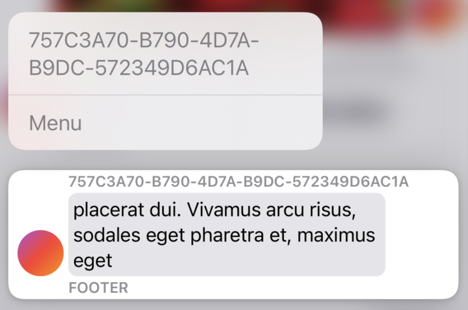

#  Implementation Guide

## Basic Concepts and Protocols

Many of the concepts here are similar to [MessageKit](https://github.com/MessageKit/MessageKit), so if you are familiar with that library you will be able to get going very quickly.

### [`MessageType`](../Sources/AllujaMessages/Models/MessageType.swift)
`MessageType` is the basic protocol used to represent messages and contains all necessary information to do so.

```swift
public enum MessageAlignment {
    case left, right
}

public protocol MessageType: Identifiable, Equatable {
    /// Unique ID that identifies this message
    var id: String { get }

    /// When the message was sent
    var timestamp: Date { get }

    /// The kind of message
    var kind: MessageKind { get }
    
    /// Determines which side the message is placed on
    /// This is ignored for messages with a `.system` kind and all custom messages
    var alignment: MessageAlignment { get }
}
```

[`MessageKind`](../Sources/AllujaMessages/Models/MessageKind.swift) determines the type of message and how it is displayed. There are a few kinds built in by default with an option for custom messages:

```swift
public enum MessageKind {
    case text(TextItem)

    case system(AttributedString)

    case image(ImageItem)

    case custom(CustomItem)
}
```

All of these have protocols or types that define a message's information, the files for which are [here](../Sources/AllujaMessages/Models/Items).

## [`MessagesView`](../Sources/AllujaMessages/Views/MessagesView.swift)
This is the main view of the library, taking the messages to be shown and an input bar view. [`BasicInputBarView`](../Sources/AllujaMessages/Views/BasicInputBarView.swift) is provided if you don't want to make your own. Many different options can be chained onto this view to modify it, all of which are explained below.

# `MessagesView` Modifiers

All of the modifiers are defined in [`MessagesViewModifiers.swift`](../Sources/AllujaMessages/Views/MessagesViewModifiers.swift).

## Basic Style Changes

AllujaMessages supports changing the default maximum message width (75% of the view width) and the default corner radius (8.0) through the `.messageMaxWidth()` and `.messageCornerRadius()` modifiers respectively. The width modifier is a closure that takes the view's geometry information and returns a `CGFloat`.

## Grouping
AllujaMessages has built-in support for message grouping along with multiple ways to customize it. This puts messages together if they fall under a certain rule (changeable by the `configureMessageEndsGroup()` modifier).

To enable grouping, chain the `.groupingOptions()` to your `MessagesView`.

The options for grouping are as follows:
```swift
public enum TimestampPositionAnchor: Equatable {
    case bottom, top
}

public enum MessageGroupingOption: Equatable {
    /// Hides profile picture for all but last message in group
    case collapseProfilePicture

    /// Collapses message header and footer to use first header and last footer for message chain
    case collapseEnclosingViews

    /// Collapses all timestamps to a single one either at the absolute top or bottom of the group
    case collapseTimestamps(TimestampPositionAnchor)
}
```

## Headers, Footers, and Avatars
All headers, footers, and avatars take a message object and return a SwiftUI view. Below is an example implementation:

```swift
} // End of MessagesView declaration
.messageHeader { message in
    Text(message.id)
        .font(.footnote)
        .bold()
        .foregroundColor(.gray)
}
.messageFooter { _ in
    if dontShowFooter {
        EmptyView() // Using an EmptyView removes the header/footer/avatar from the message
    } else {
        Text("FOOTER")
            .font(.footnote)
            .bold()
            .foregroundColor(.gray)
    }
}
.messageAvatar { message in
    if case .custom(_) = message.kind {
        EmptyView()
    } else {
        LinearGradient(colors: [.purple, .red, .orange], startPoint: .topLeading, endPoint: .bottomTrailing)
            .frame(width: 40, height: 40)
            .clipShape(Circle())
    }
}
```

Using an `EmptyView` removes the view from the message.

## Context Menus


Messages can have context menus through the `.messageContextMenu()` modifier. Similarly to headers, footers and avatars, returning an `EmptyView` from this builder disables the context menu for the specific given message.

## `ScrollViewReader` Control

AllujaMessages uses a `ScrollViewReader` internally to allow control over which messages are shown at any given time. The current implementation allows for you to hook the `.onAppear()` and `.onChange(messages)` events through the `.proxyOnAppear()` and `.proxyOnMessagesChange()` modifiers respectively. These modifiers provide a reference to the `ScrollViewProxy` given by the internal `ScrollViewReader`. `.proxyOnMessagesChange()` also provides a reference to the internal messages array which is recommended to use over your source message array due to SwiftUI's update order.

Sample recommended implementation:

```swift
} // End of MessagesView declaration
.proxyOnAppear { value in
    withAnimation {
        value.scrollTo(messages.last?.id)
    }
}
.proxyOnMessagesChange { value, msgs in
    withAnimation {
        value.scrollTo(msgs.last?.id)
    }
}
```

## Custom Messages

AllujaMessages provides a simple way to implement your own custom messages. This implementation falls into two parts: 
- Data implementation
- Renderer implementation

### Data Implementation

You need to provide a `CustomItem` implementation in order to register as a valid `MessageKind`. The protocol for which is below:

```swift
public protocol CustomItem {
    /// Unique ID for the custom item type, used to split up custom rederers into sepearate declarations
    var id: String { get }

    /// Some data for the custom type
    var data: Any? { get }
}
```

The `id` field is very important as it controls which renderer is used to display the custom message, which leads into the next section.

### Renderer Implementation

To display a custom message you need to add a renderer. A renderer is initialized as a modifier that is registered to a specific custom message ID (discussed in previous section). A renderer closure takes a message with a `.custom()` kind and a `CustomRendererInfo` structure with a suggested width and corner radius if you want to use the standard message style and returns a SwiftUI view. Multiple custom renderers may be chained to your `MessagesView`, but make sure to use a different ID for each renderer otherwise you may experience random renderer selection.

```swift
} // End of MessagesView declaration
.customRenderer(forTypeWithID: "custom1") { message, _ in
    if case .custom(let item) = message.kind {
        Text("Custom 1: Hi, \(item.data as? String ?? "unknown")")
            .foregroundColor(.accentColor)
    } else {
        Text("Error!")
    }
}
.customRenderer(forTypeWithID: "custom2") { message, info in
    HStack {
        if message.alignment == .right {
            Spacer()
        }
        
        if case .custom(let item) = message.kind {
            Text("Custom 2: Bye, \(item.data as? String ?? "unknown")")
                .frame(width: info.suggestedWidth, alignment: message.alignment == .right ? .trailing : .leading)
        } else {
            Text("Error!")
        }
        
        if message.alignment == .left {
            Spacer()
        }
    }
}
```

If you feel that your custom message cell is reusable and useful to a large number of people, open a pull request    to propose to have it converted into a built-in `MessageKind`.

## Refreshing Messages

If you want to be able to pull to refresh on the `MessagesView` for functionality such as loading earlier messages, you can use the SwiftUI `.refreshable()` modifier with an async function.

## Formatting Timestamps

The default timestamp display format shown during the timestamp drag gesture can be changed using the `.messageTimestampFormatter()` modifier and passing in a pre-configured `DateFormatter`.

## Image Placeholders

When loading images from a URL for messages with the `.image()` kind, you can specify a placeholder view to use while the image is being loaded with the `.messageImagePlaceholder()` modifier which takes a message and returns a SwiftUI view.