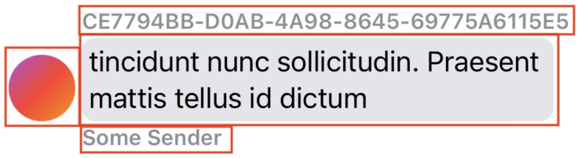
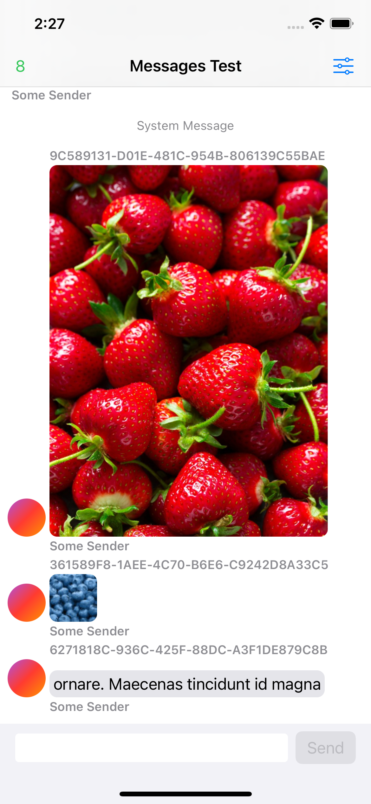

# AllujaMessages

A simple, iOS 15-based messaging UI library built from the ground up for effortless integration with SwiftUI projects, inspired by [MessageKit](https://github.com/MessageKit/MessageKit).

## Requirements and Installation
AllujaMessages requires:
- iOS 15+
- Swift 5.5+

Swift Package manager is the only supported package manager. Add AllujaMessages by copying the URL and adding it to your sources:

```
https://github.com/Alluja-LLC/Messages
```

## Getting Started

### Messages Structure


All messages implement the `MessageType` protocol with a member `MessageKind` that determines the kind of message to be displayed. This information is then converted into a SwiftUI view. Above is the basic text message (`.text(TextItem)`). From top to bottom there are header, message, and footer views along with an avatar view to the left. All of these views are customizable via modifiers to the `MessagesView` declaration.

### Input Bar
The input bar is a part of the `MessagesView` initializer and must be provided because AllujaMessages uses its focus state for scroll positiion handling. The input bar is completely customizable and can be any shape or size. `BasicInputBarView` is provided if you don't want to make your own.

To see all of the code documentation, go to the Implementation Guide.

## Default Kinds


AllujaMessages provides a small selection of different built-in message kinds including system messages (`.system(AttributedString)`, shown near the top), image messages (`.image(ImageItem)`, shown in the middle), and text messages (`.text(TextItem)`, shown at the bottom). 

You can make your own message kind by implementing the `CustomItem` protocol and using the `.custom(CustomItem)` enum value. You must also chain a `.customRenderer` modifier to your `MessagesView` declaration to be able to create a view for your custom kind. More details are available in the Implementation Guide.

## Contributing
- Use [SwiftLint](https://github.com/realm/SwiftLint)
- Look at open issues to see where you can help

## Thanks
Thanks to [MessageKit](https://github.com/MessageKit/MessageKit) for inspiring this project!